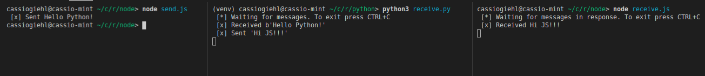

# RabbitMQ Hand Shake

## Essa aplicação foi desenvolvida para estudo da ferramenta RabbitMQ

# Fluxo

* send.js -> receive.py (queue 'hello')
* receive.py -> send.py
* send.py -> receive.js (queue 'response')

# Execução

```bash
# Execute o comando docker para instalar e executar o container a imagem do RabbitMQ
$ docker run -d --hostname my-rabbit --name some-rabbit -p 8080:15672 -p 5672:5672 -p 25676:25676 rabbitmq:3-management

# Clone o repositório e acesse a pasta do projeto
$ git clone https://github.com/cassiogiehl/rabbitmq-handshake.git
$ cd rabbitmq-handshake

# Instale as dependências JS
$ cd node
$ npm install

# Instale as dependências Python
$ cd python
$ virtualenv venv
$ source venv/bin/activate ou source venv/bin/activate.fish (no meu caso)
$ pip3 install -r requirements.txt

# Abra um terminal, acesse a pasta 'python' e execute o comando para iniciar o 'receive.py'
$ cd python
$ python3 receive.py

# Abra um terminal, acesse a pasta 'node' e execute o comando para iniciar o 'receive.js'
$ cd node
$ node receive.js

# Envie a primeira mensagem
$ cd node
$ node send.js
```

# Conclusão
<h1 align="center">
  
</h1>

## Dependências
* node >= 10.0.0
* python >= 3.0.0
* docker

## Tutorial pela documentação oficial

* [JavaScript](https://www.rabbitmq.com/tutorials/tutorial-one-javascript.html)
* [Python](https://www.rabbitmq.com/tutorials/tutorial-one-python.html)